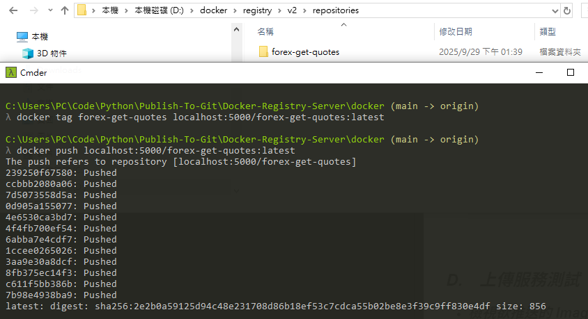

<a href='https://github.com/Junwu0615/Docker-Registry-Server'> 
[](https://www.microsoft.com/zh-tw/software-download/windows10) <br>
[](https://github.com/Junwu0615/Docker-Registry-Server)
[](https://github.com/Junwu0615/Docker-Registry-Server) <br>

<br>

## *⭐ Docker-Registry-Server ⭐*

### *A.　Current Progress*
|項目|敘述|完成時間|
|:--:|:--:|:--:|
| 專案上架 | - | 2025-09-29 |
| 成功啟動服務 | - | 2025-09-29 |
| 成功上傳服務 | - | 2025-09-29 |


<br>

### *B.　Notice*
- #### *修改設定檔*
  - ##### Linux (通常): /etc/docker/daemon.json
  - ##### Windows/macOS (Docker Desktop): 透過 Docker Desktop 的設定介面編輯 Engine 內容
  ```bash
  {
    "builder": {
      "gc": {
        "defaultKeepStorage": "20GB",
        "enabled": true
      }
    },
    "experimental": false,
    "insecure-registries": [
      "host.docker.internal:5000"
    ]
  }
  ```
  - ##### 完成後，Docker 客戶端就能夠使用 HTTP 協定連線到 localhost:5000 的私有 Registry

<br>

### *C.　Docker Build*
- #### *啟動 docker-compose*
  ```bash
  docker-compose up -d
  ```

- #### *檢視服務是否正確啟用*
  ```bash
  docker ps -a
  ```

- #### *關閉服務*
  ```bash
  docker-compose down
  ```

<br>

### *D.　上傳服務測試*
- #### *檢視欲推送的 Images 項目*
  ```bash
  docker images -a
  ```

- #### *標記一個映像檔*
  ```bash
  docker tag forex-get-quotes localhost:5000/forex-get-quotes:latest
  ```

- #### *推送映像檔*
  ```bash
  docker push localhost:5000/forex-get-quotes:latest
  ```
- 
